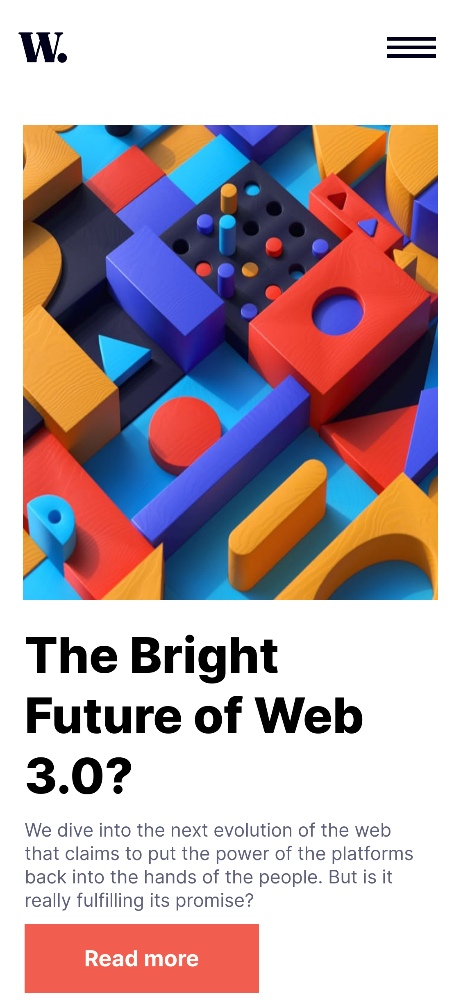
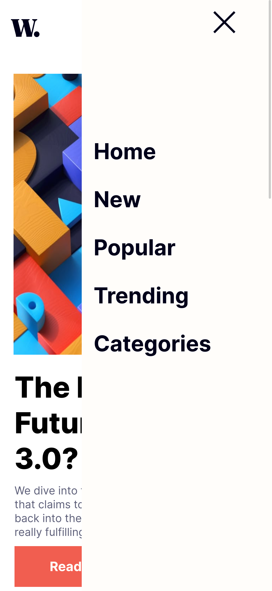
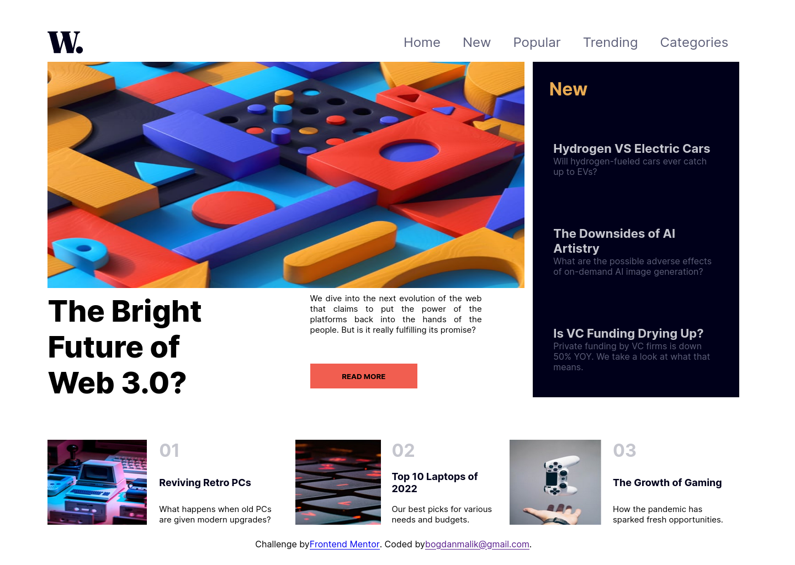

# Frontend Mentor - News homepage

## Welcome! 👋

This project is from frontend Mentor, I'm created it using HTML CSS (flexBox && Grid) and for hamburger menu im use a little bit JavaScript.

## !Important, coded only for 375px & 1440px

Link for Live : https://stellar-starburst-da586c.netlify.app/

## Code before Refactoring !

**Thanks for Fun!** 🚀

